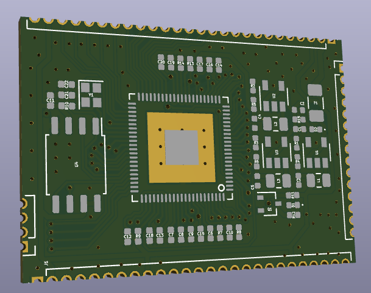
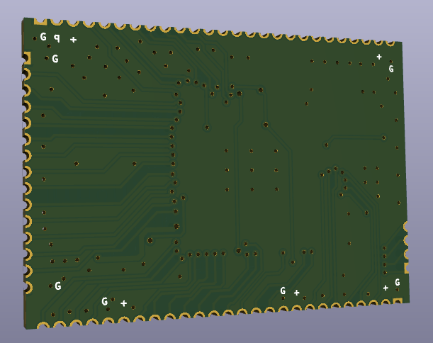

 

  

<h3 align="center">SOM-F1C</h3>

  

    A System-on-Module With Allwinner F1C Processor 
  

<!-- WHAT -->
## What?

This is a linux capable system-on-module board made with Allwinner F1C processor. It has 16MB NOR and 128MB NAND flash on board. 

## Why?

Because I wanted to.

## How?

Headers are placed to the egdes so that manufacturer can recognize it for edge plating.
